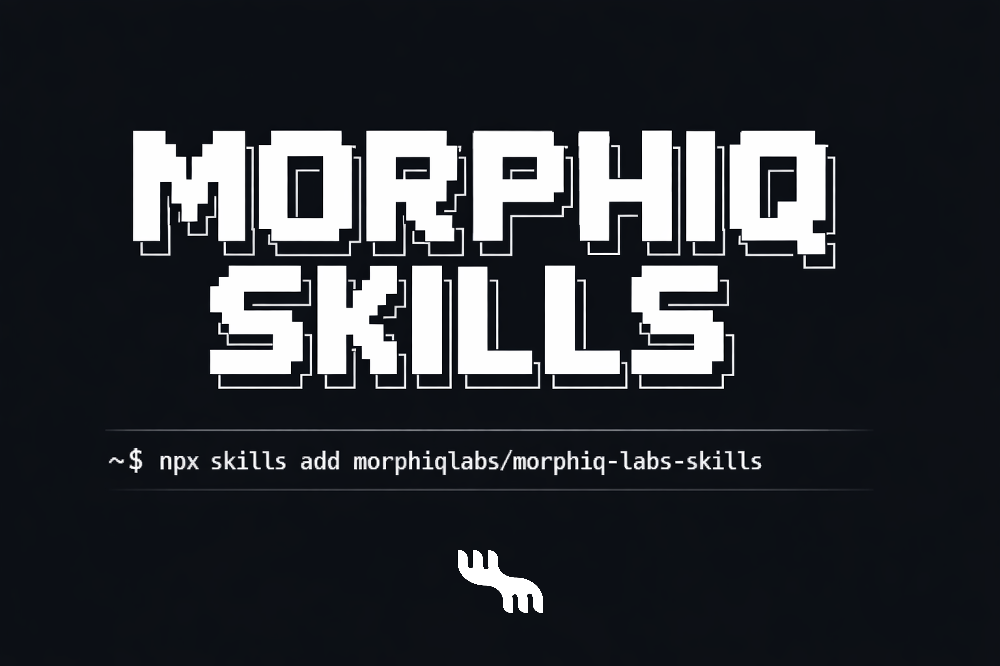

<p align="center">
  
</p>

# Morphiq Skills

AI visibility that maintains itself — audit, prioritize, fix, measure, repeat.

Morphiq Skills is a self-maintaining AI visibility pipeline. It audits your website, prioritizes what to fix, generates optimized content and schema, then measures the impact across AI providers — and loops back to do it again. Each cycle sharpens your visibility in ChatGPT, Claude, Gemini, and Perplexity.

Built on the [Agent Skills](https://agentskills.io) open standard. Works with any compatible coding agent.

## Install

**Claude Code (plugin):**

```bash
/plugin marketplace add morphiqlabs/morphiq-labs-skills
```

**Any agent (universal):**

```bash
# Install all skills
npx skills add morphiqlabs/morphiq-labs-skills

# Install a specific skill
npx skills add morphiqlabs/morphiq-labs-skills --skill morphiq-scan

# Preview available skills
npx skills add morphiqlabs/morphiq-labs-skills --list
```

## Usage

After installing, invoke skills with `/` followed by the skill name. Arguments like URLs or file paths go after the skill name.

### Recommended Workflow (User Prompts)

Send each command as a **separate message** and wait for the output file to appear before sending the next. Do not ask to "run the full pipeline" in one message.

**Message 1** → wait for `MORPHIQ-SCAN.json`:
```
Run Morphiq Scan on https://www.example.com
```

**Message 2** → wait for `MORPHIQ-RANK.json`:
```
Run Morphiq Rank
```

**Message 3** → wait for `MORPHIQ-BUILD.json`:
```
Run Morphiq Build
```

**Message 4** → wait for `MORPHIQ-TRACKER.md` (requires API keys):
```
Run Morphiq Analyze
```

Step 4 requires API keys set in your environment. See `API Keys (morphiq-track)` below.

### Claude Code

```bash
# Run the full pipeline on a domain
/morphiq-scan https://www.example.com
/morphiq-rank
/morphiq-build
/morphiq-track   # Morphiq Analyze step

# Or run a single skill
/morphiq-scan https://www.example.com
```

Each skill reads the previous skill's output automatically (`MORPHIQ-SCAN.json` → `MORPHIQ-RANK.json` → `MORPHIQ-BUILD.json` → `MORPHIQ-TRACK.json`).

### GitHub Copilot (VS Code)

Skills are available in agent mode. Reference the skill name in your prompt:

```
@workspace Use Morphiq Scan to audit https://www.example.com
@workspace Now based on all Morphiq Scan analysis, run Morphiq Rank
@workspace Now run Morphiq Build to fix those issues
@workspace Now run Morphiq Analyze (Morphiq Track) and update MORPHIQ-TRACKER.md
```

### Cursor / Windsurf / Other Agents

After installing with `npx skills add`, reference the skill by name or description in your prompt. Most agents will auto-match when you mention scanning, auditing, or AI visibility.

### What Each Command Does

| Command | Input | Output |
|---------|-------|--------|
| `/morphiq-scan <url>` | A domain URL | `MORPHIQ-SCAN.json` |
| `/morphiq-rank` | `MORPHIQ-SCAN.json` (auto-read) | `MORPHIQ-RANK.json` |
| `/morphiq-build` | `MORPHIQ-RANK.json` (auto-read) | `MORPHIQ-BUILD.json` + artifacts |
| `/morphiq-track` (Analyze) | `MORPHIQ-BUILD.json` (auto-read) + provider API keys | Delta report JSON + updated `MORPHIQ-TRACKER.md` |

> **Tip:** In Claude Code, type `/` and start typing `morphiq` to see all available skills in autocomplete.

## How It Works

The four skills form a continuous loop — not a one-shot audit:

```
morphiq-scan → morphiq-rank → morphiq-build → morphiq-track
                  ^                                  |
                  └──────────────────────────────────┘
```

1. **Scan** your site across 5 AI visibility categories (100-point rubric)
2. **Rank** findings into a prioritized, tiered roadmap
3. **Build** fixes — schema, content, policy files, metadata
4. **Track** impact across AI providers, surface new gaps
5. Feed deltas back to Rank. Repeat.

Each skill produces structured JSON that the next skill consumes. Data contracts are defined in [PIPELINE.md](PIPELINE.md).

## Skills

### morphiq-scan — Audit

Crawls a target domain and produces a full AI visibility audit.

- Technical structure and agentic readiness analysis
- Schema markup coverage evaluation (17 AEO-relevant types)
- Content quality and E-E-A-T assessment
- LLM chunking and retrieval quality scoring
- Query fan-out simulation (per-model sub-question chains)
- Policy file detection (robots.txt, llms.txt, sitemap.xml)
- 100-point scoring across 5 weighted categories

**Output:** Scan Report (JSON) -> morphiq-rank

### morphiq-rank — Prioritize

Takes scan output and produces a prioritized action roadmap.

- Weights every issue by AI visibility impact
- Organizes into 4 progressive discovery tiers (Foundation -> Structure -> Content -> Optimization)
- Ranks by severity, page impact, citation potential, and effort
- Cross-category deduplication prevents duplicate work
- Progressive reveal — surfaces issues incrementally, not all at once

**Output:** Prioritized Roadmap (JSON) -> morphiq-build

### morphiq-build — Implement

Creates and optimizes content for AI visibility. Three entry points:

**From roadmap** — processes issues by tier and priority, routes each to the appropriate fix workflow.

**From prompt** — generates AEO-structured content from a topic and optional sources.

**From existing content** — runs the 6-step Content Lab pipeline:
1. Ingest sources (URLs, PDFs, raw text)
2. Extract and structure content
3. Analyze gaps against query space
4. Research live web to fill gaps
5. Generate optimized content with schema
6. Validate coverage against target queries

Also handles: JSON-LD injection, llms.txt generation, metadata optimization, FAQ creation, citation formatting.

**Output:** Build Artifacts (JSON) -> morphiq-track

### morphiq-track — Analyze & Monitor

Measures AI visibility across providers and drives the feedback loop.

- Generates prompt sets from website/build context
- Runs provider queries using any configured provider API keys; missing providers are skipped with a warning
- Captures full responses, sources, citations, and sub-queries
- Produces inputs for content correction and content creation workflows
- Generates 50 prompts across 5 GEO categories (organic, competitor, how-to, brand, FAQ)
- Queries OpenAI, Gemini, Perplexity, and Anthropic APIs
- Computes Share of Voice, citation rates, and brand positioning
- Tracks deltas between runs — what improved, what regressed
- Drives 3 ongoing workflows: content optimization, content creation, query fanout expansion
- Maintains persistent state in MORPHIQ-TRACKER.md and JSON state layer

**Output:** Delta Report (JSON) -> loops back to morphiq-rank

## Scoring

| Category | Points | What It Measures |
|----------|--------|-----------------|
| Agentic Readiness | 45 | Schema markup, metadata, machine-readability |
| Content Quality | 20 | Depth, E-E-A-T, citations, examples |
| Chunking & Retrieval | 15 | Heading hierarchy, paragraph quality, retrieval resilience |
| Query Fan-Out | 10 | Sub-question coverage across AI reasoning chains |
| Policy Files | 10 | robots.txt, llms.txt, sitemap configuration |

## API Keys (morphiq-track)

morphiq-track queries AI providers directly. Set these environment variables for the providers you want to use:

```
OPENAI_API_KEY        # GPT web_search tool
ANTHROPIC_API_KEY     # Claude tool use pattern
PERPLEXITY_API_KEY    # Native search behavior
GEMINI_API_KEY        # Grounding with URL resolution
```

If one or more keys are missing, morphiq-track will warn and use the providers that are configured.
If none are set, it will warn and exit without querying providers.

## Project Structure

```
morphiq-labs-skills/
├── README.md
├── PIPELINE.md          # Data contracts between skills
├── LICENSE
└── skills/
    ├── morphiq-scan/    # Audit
    ├── morphiq-rank/    # Prioritize
    ├── morphiq-build/   # Implement
    └── morphiq-track/   # Monitor
```

Each skill contains:
- `SKILL.md` — Workflow instructions and frontmatter (the skill definition)
- `references/` — Deep methodology docs, loaded on demand
- `scripts/` — Deterministic utilities the agent calls
- `evals/` — Self-tests and evaluation fixtures

## Sources

The methodology behind these skills draws from:

- [Anthropic — Contextual Retrieval](https://www.anthropic.com/research/contextual-retrieval) — Chunking, embedding, and reranking research
- [Google — Ranking Systems Guide](https://developers.google.com/search/docs/appearance/ranking-systems-guide) — Passage ranking and structured data
- [HuggingFace — Chunking Strategies (2601.14123)](https://huggingface.co/papers/2601.14123) — Chunk size vs retrieval reliability
- [HuggingFace — BRIGHT Benchmark (2407.12883)](https://huggingface.co/papers/2407.12883) — Reasoning-intensive retrieval
- [Search Engine Land — ChatGPT Citation Study](https://searchengineland.com/chatgpt-citations-content-study-469483) — Citation position and content structure
- [llms-txt Specification](https://llmstxt.org) — Machine-readable site overview format

## License

Apache-2.0

## Links

- [Morphiq Labs](https://trymorphiq.com) — Self driving AI visibility platform
- [Agent Skills Standard](https://agentskills.io) — Open skill specification
- [skills.sh](https://skills.sh) — Agent skills marketplace
